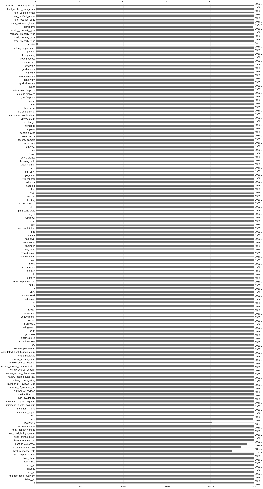
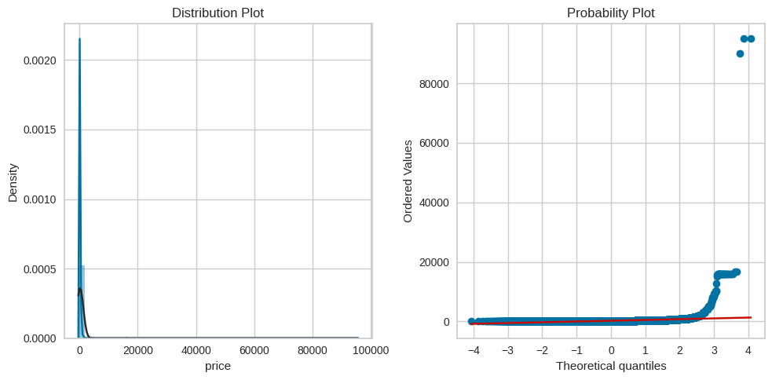
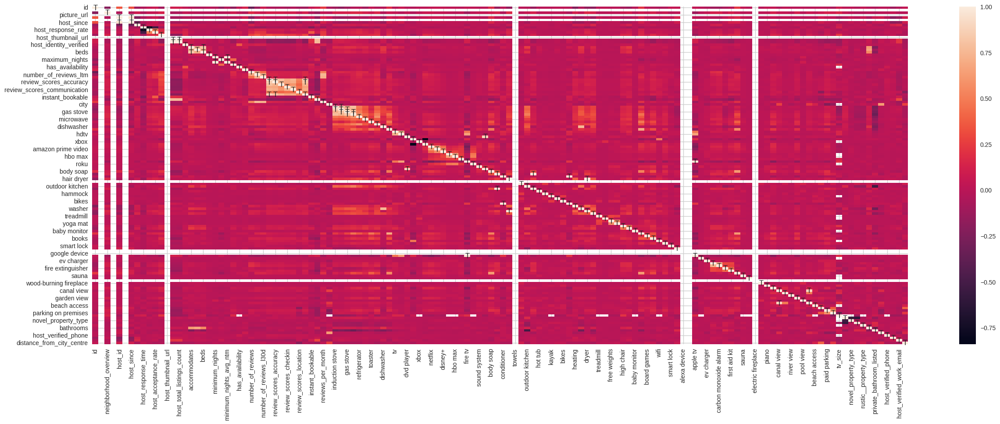

# Airbnb Insights: Price and Review Prediction

A machine learning project analyzing Airbnb listings from Italian cities (Florence, Naples, and Venice) to predict listing prices and review scores using XGBoost regression models.

## Overview

This project uses the InsideAirbnb dataset to identify key factors affecting Airbnb listing prices and customer satisfaction. The analysis focuses on amenities, location features, and host characteristics to build predictive models.

**Key Objectives:**
- Predict listing prices based on property features and amenities
- Predict review scores to understand customer satisfaction drivers
- Analyze the importance of different amenities across Italian cities

## Dataset

- **Source:** InsideAirbnb (September 2023)
- **Cities:** Florence, Naples, Venice
- **Features:** 75+ attributes including amenities, location, property type, host information, and availability

## Methodology

### 1. Data Preprocessing
- Consolidated data from three Italian cities
- Handled missing values and removed sparse columns
- Combined over 5,000 listings into unified dataset



### 2. Feature Engineering
Created new features to enhance model performance:
- **Amenities encoding:** Binary features for 95+ amenity types (WiFi, kitchen, pool, etc.)
- **Distance to city center:** Calculated using latitude/longitude coordinates
- **Host metrics:** Response time, verification status, listing count
- **Availability features:** Seasonal availability patterns
- **Categorical encoding:** Property type, room type, neighborhood



### 3. Feature Selection
- Correlation analysis to identify relationships between features
- Removed highly correlated features to prevent multicollinearity
- Selected most impactful features for modeling



### 4. Modeling

**Price Prediction:**
- XGBoost regression model (primary)
- Linear regression baseline (for comparison)
- Log-transformed target variable for better performance
- Individual models trained per city for localized predictions

**Review Score Prediction:**
- XGBoost regression for overall rating
- Separate models for rating dimensions (accuracy, cleanliness, location, etc.)
- City-specific models to capture regional preferences

## Key Findings

- **Amenities matter:** Certain amenities (WiFi, kitchen, parking) significantly impact pricing
- **Location is crucial:** Distance to city center strongly correlates with price
- **Property type effects:** Entire homes command higher prices than shared rooms
- **Host factors:** Superhost status and response time influence reviews

## Technologies Used

- **Python 3.x**
- **Libraries:** pandas, scikit-learn, XGBoost, matplotlib, seaborn, missingno
- **Environment:** Google Colab

## Project Structure

```
Airbnb-Insights/
├── FinalProject_351.ipynb    # Main analysis notebook
├── figures/                   # Visualizations and plots
├── LICENSE                    # GPL-3.0 License
└── README.md                  # This file
```

## Usage

1. Open `FinalProject_351.ipynb` in Google Colab or Jupyter
2. Upload the InsideAirbnb dataset CSV files for Florence, Naples, and Venice
3. Run cells sequentially to reproduce the analysis
4. Models will be trained and evaluated automatically

## Results

The XGBoost models significantly outperformed linear baseline models for both price and review prediction tasks. City-specific models showed improved performance compared to a single unified model, suggesting regional variations in pricing and guest preferences.

## License

This project is licensed under the GNU General Public License v3.0 - see the [LICENSE](LICENSE) file for details.

## Acknowledgments

- Data provided by [InsideAirbnb](http://insideairbnb.com/)
- CMPE 351 Final Project - Queen's University
- Group 10